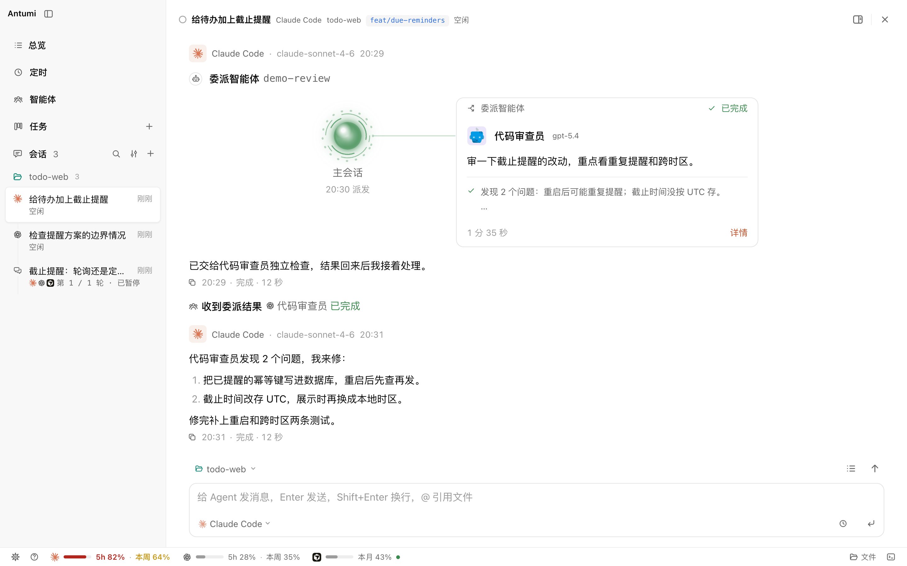
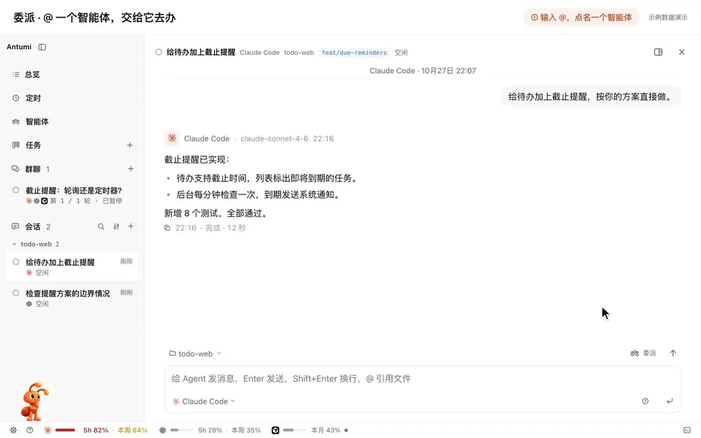
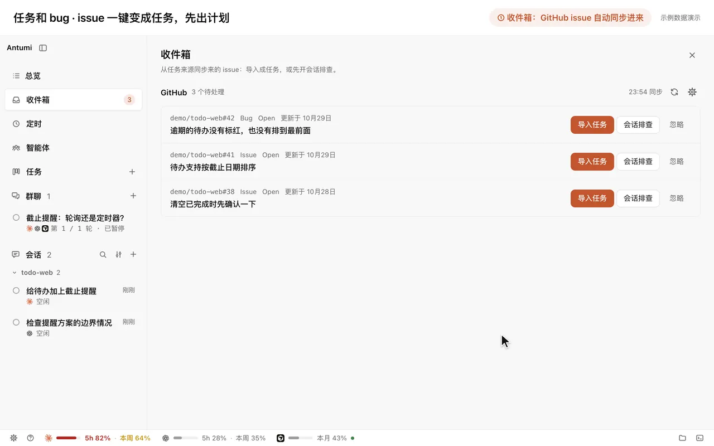
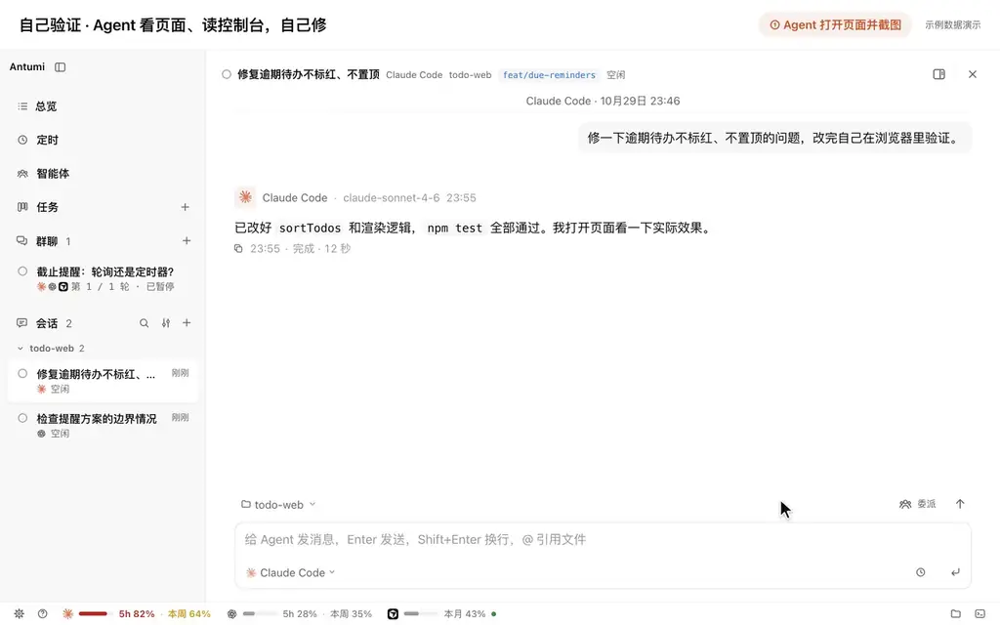
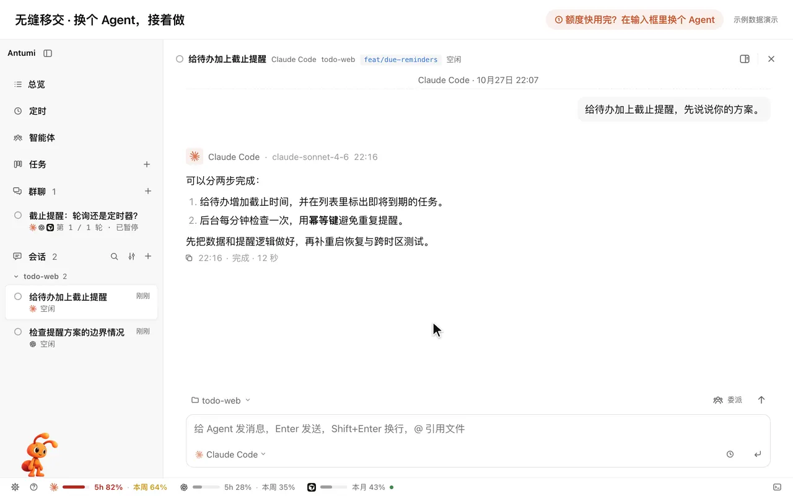

<div align="center">

# Antumi（安图米）

**让已经装好的 Claude Code、Codex 等 Agent 一起把任务做到你验收。**

本地桌面应用。它驱动你登录好的 Agent CLI：一个实现，另一个审查，在内置浏览器里自己验证，结果由你合并。配置和登录都不用重来。

多 Agent 协作 · 从 issue 开工 · 自己验证 · 额度用完接着跑

[](https://github.com/flyhero/antumi/releases)
[](https://github.com/flyhero/antumi/releases)

[](LICENSE)

[下载](https://github.com/flyhero/antumi/releases) · [三分钟开始](#三分钟开始) · [和终端比](#和直接开终端比) · [支持的 Agent](#支持的-agent) · [文档](#文档)

**简体中文** · [English](README.en.md)

<p align="center">
  <a href="#支持的-agent" title="Claude Code"></a>&nbsp;&nbsp;
  <a href="#支持的-agent" title="Codex"></a>&nbsp;&nbsp;
  <a href="#支持的-agent" title="Cursor"></a>&nbsp;&nbsp;
  <a href="#支持的-agent" title="OpenCode"></a>&nbsp;&nbsp;
  <a href="#支持的-agent" title="Pi"></a>&nbsp;&nbsp;
  <a href="#支持的-agent" title="DeepSeek Harness"></a>&nbsp;&nbsp;
  <a href="#支持的-agent" title="Antigravity"></a>&nbsp;&nbsp;
  <a href="#支持的-agent" title="ZCode"></a>&nbsp;&nbsp;
  <a href="#支持的-agent" title="Kimi Code"></a>&nbsp;&nbsp;
  <a href="#支持的-agent" title="Gemini CLI"></a>
</p>



https://github.com/user-attachments/assets/74747188-10e9-4d1d-b444-86c867f25c58

</div>

目前是开发版（0.21.x），主要在 macOS 上开发和测试。Windows 和 Linux 可以安装和打包。

## 适合谁

你已经在终端里用 Claude Code、Codex 或其他 Agent CLI，想让它们一起把一件事从计划做到验收，而不是在几个窗口之间复制粘贴。

Antumi 不替换这些 CLI，也不要求重新登录。终端里聊到一半的会话可以导进来接着聊。

## 和直接开终端比

下面四段是从接到任务到交出结果的整条路径。其余能力见[还能做什么](#还能做什么)，细节在[使用指南](docs/GETTING-STARTED.md)。

### 多个 Agent 一起做

五个窗口里谁在等批准、谁已经做完，得挨个切过去看。在 Antumi 里，输入框打 `@` 就能把活交给本机另一个已就绪的 Agent，或交给存好的角色（代码审查员、测试验证专员）。子会话独立工作，结果回到主会话。只读分析和独立 worktree 里的开发可以同时进行。

每个任务一个 worktree，代码互不干扰。等你批准、回答、验收的事集中在总览里，做完或在等你时会发系统通知。

[委派](docs/ARCHITECTURE.md#智能体与委派) · [移交](docs/GETTING-STARTED.md#无缝移交)



### 从 issue 开工

GitHub、Jira、Linear、禅道的 issue 同步进侧栏「收件箱」，一键导入成任务。开始后自动建好 worktree 和带 issue 编号的分支。Agent 先读代码、拿出计划，你批准后才改代码。原因还不清楚的 bug 可以先排查再动手。任务之间可设前置依赖，前一个验收通过才解锁下一个。

[接入来源](docs/GETTING-STARTED.md#任务来源) · [任务怎么流转](docs/ARCHITECTURE.md#2-任务模型)



### 它先验证，你再验收

Agent 在内置浏览器里打开页面、点击、读控制台和网络请求、截图，在内置终端里看开发服务器的输出，发现问题自己接着修。你随时可以接管页面，或把选中的元素、截图加进会话。做完后看整条任务分支的 diff、跑项目检查，满意了再合并。

[内置浏览器](docs/ARCHITECTURE.md#5-内置浏览器) · [验收](docs/ARCHITECTURE.md#验收之后)



### 额度用完，接着跑

配了多个 Claude Code 或 Codex 账号时，额度用完会自动换号，在原会话里继续。没有可换的号，就等额度恢复后自动继续，也可以移交给另一个 Agent。底部状态栏显示各 Agent 的用量和恢复时间。

[多个账号](docs/GETTING-STARTED.md#多个账号) · [额度节奏](docs/ARCHITECTURE.md#额度节奏与建议)



## 数据在你的机器上

装之前可以先知道这几件事：

- 任务、会话和 worktree 在 `~/.antumi/`。核心功能不依赖 Antumi 托管服务。
- core 只监听 `127.0.0.1`，连接要带本机 token。
- Agent 以参数数组启动，不经过 shell；prompt 前加 `--`。
- Jira、GitHub 凭据单独存放（权限 600），不返回给界面，也不交给 Agent。
- 导入的 issue 原文包在 `<untrusted-source>` 里交给 Agent；任务图片保存前去掉 EXIF。
- 有未提交改动、或只有这份 worktree 里才有的提交，清理时一律保留，分支从不删。闲置 worktree 默认 7 天后清理，可在设置 → 会话里调整或关闭。

## 三分钟开始

需要至少装好并登录一个 Agent CLI。ZCode 用桌面版或 `zcode-app-cli`；Antigravity 在设置 → 外部智能体里下载。第一次打开会检查 Agent 装没装、能不能用。安装包本身不需要 Node。

1. **安装。** 到 [Releases](https://github.com/flyhero/antumi/releases) 下载：macOS Apple Silicon、Windows x64、Linux x64。macOS 只有 ad-hoc 签名，拖进「应用程序」后先去掉隔离属性，再打开：

   ```bash
   xattr -dr com.apple.quarantine /Applications/Antumi.app
   ```

2. **交一个小任务。** 侧栏「任务」点 +，选项目和 Agent，写一句要改什么，点「开始执行」。Antumi 建好独立 worktree。Agent 先拿出计划，你批准后它才改代码。

3. **验收。** 做完会有系统通知。在右侧检查器看整条分支的 diff，跑项目检查，让 Agent 在内置浏览器里打开页面。满意了再合并。

要从 issue 导入任务，先在设置 → 插件装上来源插件。定时和预约需要电脑保持唤醒。接服务商、配多个账号见[使用指南](docs/GETTING-STARTED.md)，应用里也可以从帮助 → 使用指南打开。

<details>
<summary><b>macOS 通知、Windows、Linux</b></summary>

**macOS。** 不要在 dmg 里直接运行，否则系统通知发不出来。去掉隔离属性后，第一次发通知时选「允许」。错过了就到「系统设置 → 通知 → Antumi」打开「允许通知」，样式选「横幅」或「提示」。不想敲命令时，可以先双击被拦一次，再去「系统设置 → 隐私与安全性」点「仍要打开」。排查见[打包与安装](docs/ARCHITECTURE.md#8-打包与安装)。

**Windows。** 安装包没有签名，SmartScreen 会拦一下，点「更多信息 → 仍要运行」。

**Linux。** Debian、Ubuntu：`sudo apt install ./Antumi-<版本>-linux-amd64.deb`。其他发行版用 AppImage：`chmod +x` 后运行；Ubuntu 22.04 及以上先 `sudo apt install libfuse2`。Ubuntu 23.10 及以上若报 sandbox 错误，改用 deb，或加 `--no-sandbox`。AppImage 会在后台自动更新；deb 只提示新版本，需要重新下载安装。

</details>

<details>
<summary><b>从源码运行</b></summary>

需要 Node ≥ 22.13 和 pnpm 12。装了安装包的机器不需要这两样。

```bash
git clone https://github.com/flyhero/antumi.git
cd antumi
pnpm install
pnpm dev
```

手动试用时用测试目录，避免碰到自己的真实数据：

```bash
ANTUMI_HOME=~/.antumi-demo pnpm dev
```

打包：`pnpm dist:mac`（Apple Silicon）、`pnpm dist:win`（x64，在 macOS 上也能打）、`pnpm dist:linux`（x64，只能在 Linux 上打，需要 `build-essential` 和 `python3`）。产物在 `packages/desktop/dist/`。步骤见[发版与打包](docs/RELEASING.md)。

</details>

## 支持的 Agent

它们之间都能相互移交。普通会话和单 Agent 任务里打 `@`，可以把活委派给本机已就绪的任何一个。

| Agent | 接入方式 | 常用权限模式 | 计划审批 | 只读委派 | 定时 / 预约 |
|---|---|---|:-:|:-:|:-:|
| [**Claude Code**](https://github.com/anthropics/claude-code) | `claude -p`（stream-json） | 逐项确认 · 自动接受编辑 · 规划 · 自动判断 | ✓ | ✓ | ✓ |
| [**Codex**](https://github.com/openai/codex) | `codex app-server` | 逐项确认 · 自动 · 规划 · 只读 | ✓ | ✓ | ✓ |
| [**Cursor**](https://cursor.com/cli) | `cursor-agent acp` | Agent · Plan · Ask | ✓ | ✓ | — |
| [**OpenCode**](https://opencode.ai) | `opencode acp` | Build · 自动 · Plan · 只读 | — | ✓ | ✓ |
| [**Pi**](https://pi.dev) | `pi --mode rpc` | 默认 · 自动 · 规划 · 只读 | ✓ | ✓ | ✓ |
| [**DeepSeek Harness**](docs/DEEPSEEK.md) | `dsh --profile antumi`（ACP） | 默认 · 自动 · 规划 · 只读 | ✓ | ✓ | ✓ |
| [**Antigravity**](docs/ANTIGRAVITY.md) | Google 的 Antigravity ACP 服务 | Default · Auto Edit | — | — | — |
| [**ZCode**](docs/ZCODE.md) | `zcode app-server` | 修改前询问 · 自由编辑 · 规划 · 自主 · 只读 | ✓ | ✓ | ✓ |
| [**Kimi Code**](docs/KIMI.md) | `kimi acp`（Node.js 版 2.3.2+） | Default · Plan · Auto | ✓ | ✓ | ✓ |
| [**Gemini CLI**](docs/GEMINI.md) | `gemini --acp`（0.66.0+） | Default · Auto Edit · Plan | ✓ | — | ✓ |

「只读委派」为 — 的，只能以可改代码的方式被委派。你自己聊的会话里，「全部放行」不会默认选中。定时和预约这类无人值守运行，新安装默认「全部放行」，可在设置 → 权限改成更谨慎的「稳妥」。设置 → 外部智能体还会列出 Antumi 认识、但尚未接入的 Agent CLI。

也可以不走官方账号：在设置 → 服务商接入火山方舟、智谱、Kimi 等编程套餐，或自定义接口。Cursor 用不了服务商。通过代理使用订阅账号可能违反服务条款并导致封号，见[使用指南](docs/GETTING-STARTED.md#模型服务商)。

## 还能做什么

| | |
|---|---|
| **群聊** | 2–5 个 Agent 讨论方案：圆桌、分工调研或起草评审。讨论只读，不改代码。[说明](docs/ARCHITECTURE.md#群聊) |
| **团队** | 队长、开发和评审在同一个 worktree 里协作：开发串行，只读分析可并行。[说明](docs/ARCHITECTURE.md#团队) |
| **分屏** | 按住 ⌘ 点另一个会话，一边实现，一边看另一个 Agent 的建议。[说明](docs/GETTING-STARTED.md#分屏两个会话并排) |
| **定时与预约** | 按每天、工作日或每周跑；也可以把一条消息预约到指定时间或额度恢复后。Cursor 与 Antigravity 暂不支持。电脑需保持唤醒。[说明](docs/GETTING-STARTED.md#预约额度恢复后或到点再发) |
| **小助手与翻译** | 选中一段交给小助手解释，或把回复翻成你的语言。用轻量模型，不占主会话上下文。语言和自动翻译在设置 → 会话。[说明](docs/GETTING-STARTED.md#小助手与翻译) |
| **待办** | Agent 记下要你之后做的事，在检查器里勾掉；总览汇总所有会话。[说明](docs/ARCHITECTURE.md#待办) |
| **文件、终端、浏览器** | 在工作台里改文件、看开发服务、验证页面。三个面板都能拖成独立窗口。 |
| **引用与知识库** | 输入框打 `@` 引用文件、项目或以前的会话。Agent 可以把笔记写进你的 Markdown 或 Obsidian 知识库。 |
| **用量** | 统计一段时间内的用量，并估计额度什么时候用完。[说明](docs/USAGE-ANALYTICS.md) |

常用快捷键：看板上 <kbd>N</kbd> 记一条任务，<kbd>⌘</kbd><kbd>K</kbd> 搜索，<kbd>⌘</kbd><kbd>E</kbd> / <kbd>⌘</kbd><kbd>J</kbd> / <kbd>⌘</kbd><kbd>L</kbd> 打开文件、终端、浏览器。完整列表在设置 → 快捷键，23 项可改、可禁用，改完立即生效。

## 文档

| | |
|---|---|
| **使用** | [使用指南](docs/GETTING-STARTED.md) · [用量账本](docs/USAGE-ANALYTICS.md) · [Markdown 主题](docs/MARKDOWN-THEMES.md) · [Antigravity](docs/ANTIGRAVITY.md) · [DeepSeek Harness](docs/DEEPSEEK.md) · [ZCode](docs/ZCODE.md) · [Kimi Code](docs/KIMI.md) · [Gemini CLI](docs/GEMINI.md) |
| **扩展** | [任务来源插件](docs/PLUGINS.md)：GitHub、Jira、Linear、禅道，或自己写一个 |
| **开发** | [技术架构](docs/ARCHITECTURE.md) · [AGENTS.md](AGENTS.md) · [DESIGN.md](DESIGN.md) |
| **发布** | [发版与打包](docs/RELEASING.md) · [更新日志](CHANGELOG.md) |

## 参与

用下来哪里别扭、想接哪个 Agent，欢迎提 [issue](https://github.com/flyhero/antumi/issues)。

改代码前先读 [AGENTS.md](AGENTS.md) 和 [DESIGN.md](DESIGN.md)。提交前跑：

```bash
pnpm typecheck && pnpm test
```

桌面端改动再加 `pnpm build`。

## 接下来

按优先级：Windows 上的日常使用、自动更新和 CI；让 Agent 在 SSH / WSL 里的仓库上干活，看板留在本机；继续接入更多 Agent CLI。

## 许可

[Apache License 2.0](LICENSE)。
